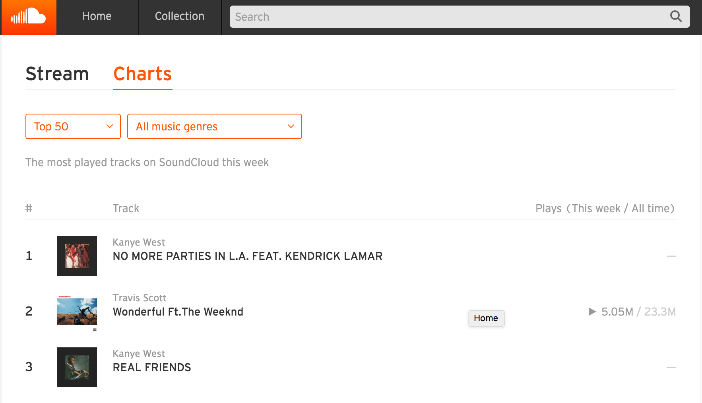

HOME / APPS

# SoundCloud finally gets serious about music discovery with top charts

by OWEN WILLIAMS

You could be forgiven for wondering what SoundCloud has been up to lately, as it’s been somewhat quiet. But, today, it’s [finally rolled out top charts](https://soundcloud.com/charts/top?genre=top&ref=producthunt).

The new feature lets you see the top 50 songs across the service by week at any given time and breaks them down further into genres. You’ll see how many plays it’s gotten this week, as well as how many it’s received overall.

SoundCloud is a great place for finding new music from emerging artists, but its explore feature was seeing big competition from competitors like Spotify’s Discover Weekly, which delivers personalized playlists every week.

All SoundCloud needs to do next to complete the magic trifecta of music discovery is acquire [Hype Machine](http://hypem.com/), which spots popular tracks based on how popular they are on music blogs.

[SoundCloud Charts](https://soundcloud.com/charts/top?genre=top&ref=producthunt)
