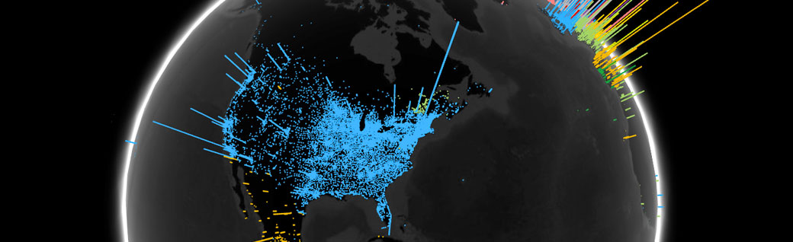
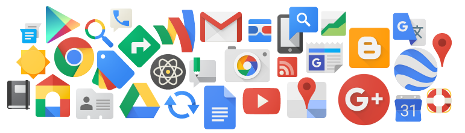

About Google

#### Google’s mission is to organize the world’s information and make it universally accessible and useful.

[Products](https://www.google.com/intl/kr/about/products/) - [Company](https://www.google.com/intl/kr/about/company/) - [Management](https://www.google.com/intl/kr/about/company/facts/management/)

***

## Who we are
#### The people behind Google
Building great products depends on great people. There are more than 40,000 Googlers behind the tools that you use every day—from search to Chrome. Find out more about what it’s like to work at Google, where we work and who drives our company strategy below.

###### Our Culture
It’s really the people that make Google the kind of company it is. We hire people who are smart and determined, and we favor ability over experience. Although Googlers share common goals and visions for the company, we hail from all walks of life and speak dozens of languages, reflecting the global audience that we serve. And when not at work, Googlers pursue interests ranging from cycling to beekeeping, from frisbee to foxtrot.

###### Locations
We’ve come a long way from the dorm room and the garage. We moved into our headquarters in Mountain View, California—better known as the Googleplex—in 2004. Today Google has more than 70 offices in more than 40 countries around the globe.

# What we believe
### Five things we know to be Troubleshooting
We first wrote these “5 things” when Google was just a few years old. From time to time we revisit this list to see if it still holds true. We hope it does—and you can hold us to that.

1. Focus on the user and all else will follow.  
Since the beginning, we’ve focused on providing the best user experience possible. Whether we’re designing a new Internet browser or a new tweak to the look of the homepage, we take great care to ensure that they will ultimately serve you, rather than our own internal goal or bottom line. Our homepage interface is clear and simple, and pages load instantly. Placement in search results is never sold to anyone, and advertising is not only clearly marked as such, it offers relevant content and is not distracting. And when we build new tools and applications, we believe they should work so well you don’t have to consider how they might have been designed differently.

2. It’s best to do one thing really, really well.   
We do search. With one of the world’s largest research groups focused exclusively on solving search problems, we know what we do well, and how we could do it better. Through continued iteration on difficult problems, we’ve been able to solve complex issues and provide continuous improvements to a service that already makes finding information a fast and seamless experience for millions of people. Our dedication to improving search helps us apply what we’ve learned to new products, like Gmail and Google Maps. Our hope is to bring the power of search to previously unexplored areas, and to help people access and use even more of the ever-expanding information in their lives.

3. Fast is better than slow.    
We know your time is valuable, so when you’re seeking an answer on the web you want it right away–and we aim to please. We may be the only people in the world who can say our goal is to have people leave our website as quickly as possible. By shaving excess bits and bytes from our pages and increasing the efficiency of our serving environment, we’ve broken our own speed records many times over, so that the average response time on a search result is a fraction of a second. We keep speed in mind with each new product we release, whether it’s a mobile application or Google Chrome, a browser designed to be fast enough for the modern web. And we continue to work on making it all go even faster.

4. Democracy on the web works.    
Google search works because it relies on the millions of individuals posting links on websites to help determine which other sites offer content of value. We assess the importance of every web page using more than 200 signals and a variety of techniques, including our patented PageRank™ algorithm, which analyzes which sites have been “voted” to be the best sources of information by other pages across the web. As the web gets bigger, this approach actually improves, as each new site is another point of information and another vote to be counted. In the same vein, we are active in open source software development, where innovation takes place through the collective effort of many programmers.

5. You don’t need to be at your desk to need an answer.   
The world is increasingly mobile: people want access to information wherever they are, whenever they need it. We’re pioneering new technologies and offering new solutions for mobile services that help people all over the globe to do any number of tasks on their phone, from checking email and calendar events to watching videos, not to mention the several different ways to access Google search on a phone. In addition, we’re hoping to fuel greater innovation for mobile users everywhere with Android, a free, open source mobile platform. Android brings the openness that shaped the Internet to the mobile world. Not only does Android benefit consumers, who have more choice and innovative new mobile experiences, but it opens up revenue opportunities for carriers, manufacturers and developers.

# What we do
### Our products and services
We provide a variety of services for people and businesses. Here's a glimpse at what we offer.

   

###### What we do for you
Larry Page, our co-founder and CEO, once described the “perfect search engine” as something that “understands exactly what you mean and gives you back exactly what you want.” Since he spoke those words Google has grown to offer products beyond search, but the spirit of what he said remains. With all our technologies—from search to Chrome to Gmail—our goal is to make it as easy as possible for you to find the information you need and get the things you need to do done.

This means making search smarter and faster, so it can understand that when you type [jaguar] you’re looking for the car, not photos of the animal. It means showing you when your friends like an ad or a search result, so that you know it might be valuable. It means making our products work intuitively, so that you can share documents with Gmail contacts without having to copy and paste, and open the same tabs on your Android phone that you have open on your Chrome browser on your desktop. Above all, it means making our products work better so that people can spend time on the stuff they’re good at—like enjoying time with family, camping in the wilderness, painting a picture or throwing a party. We’re not there yet, but we’re working on it.

[Find a list of all our products »](https://www.google.com/intl/en/about/products/)

###### What we do for businesses
We provide a variety of tools to help businesses of all kinds succeed on and off the web. These programs form the backbone of our own business; they’ve also enabled entrepreneurs and publishers around the world to grow theirs. Our advertising programs, which range from simple text ads to rich media ads, help businesses find customers, and help publishers make money off of their content. We also provide cloud computing tools for businesses that save money and help organizations be more productive.

[Find a list of all our business offerings »](https://www.google.com/intl/en/services/)

###### What we do for the web
We build products that we hope will make the web better—and therefore your experience on the web better. With products like Chrome and Android, we want to make it simpler and faster for people to do what they want to online. We’re also committed to the open web, so we’re involved in various projects to make it easier for developers to contribute to the online ecosystem and move the web forward. And we work hard to create a web that’s better for the [environment](http://www.google.com/green/), by using resources efficiently and supporting renewable power. The web has evolved enormously since Google first appeared on the scene, but one thing that hasn't changed is our belief in the endless possibilities of the Internet itself.
